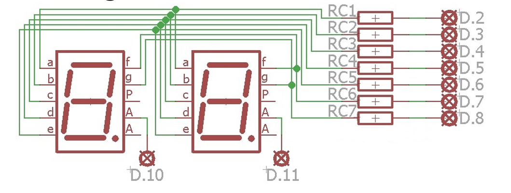
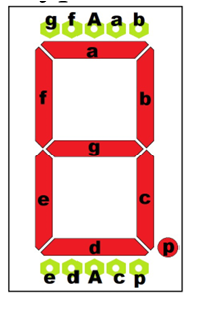
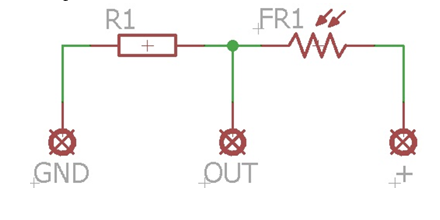
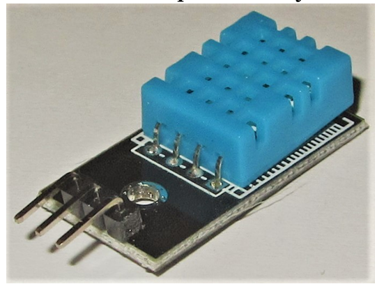

# 1. Wprowadzenie

Ćwiczenie to pozwala na zastosowanie i zrozumienie sensorów posiadających swoje własne układy zarządzające. Sensory tego rodzaju wymagają realizacji procesu komunikacji między danym mikroprocesorem a sterownikiem sensora. Do zrealizowania zadań komunikacja wymagana jest dla czujników:

- Czujnik temperatury i ciśnienia BMP180
- Czujnik temperatury i wilgotności DHT11
- Czujnik odległości HC-SR04
- Czujnik jakości powietrza MQ-135 (**ZESTAW B**)

Komunikacja nie jest wymagana w przypadku czujników:
- Czujnik ruchu HC-SR501
- Czujnik dźwięku Arduino AVR
- Fotorezystor 5- 10 kOhm i 10 - 20 kOhm
- Potencjometr 10 kOhm
- Mikroprzycisk x5
- Enkoder
- Mikroprzełącznik

# 2. Pomiar temperatury i ciśnienia

**Zadanie 1:**

Zadanie polega na realizacji pomiaru temperatury i ciśnienia w układzie Raspberry PI3 poprzez wykorzystanie czujnika BMP180. Sensor podłączamy do następujących wyprowadzeń złącze GPIO:
- 1: 3V3
- 3: GPIO2 I2C.SDA
- 5: GPIO3 I2C.SCL
- 9: GND

Po podłączeniu sensora BMP180 do układu Raspberry PI3 należy napisać program realizujący obsługę tego czujnika. Niezbędne będzie zainstalowanie odpowiednich bibliotek w mikrokomputerze.

- Jeśli prawidłowo został podłączony czujnik do mikrokomputera to po wykonaniu w terminalu polecenia `sudo i2cdetect -y 1` odpowiedź będzie następująca:

&emsp;&ensp; 0&nbsp;  1&nbsp;  2&nbsp;  3&nbsp;  4&nbsp;  5&nbsp;  6&nbsp;  7&nbsp;  8&nbsp;  9&nbsp;  a&nbsp;  b&nbsp;  c&nbsp;  d&nbsp;  e&nbsp;  f\
00: -- -- -- -- -- -- -- -- -- -- -- -- -- -- -- --\
10: -- -- -- -- -- -- -- -- -- -- -- -- -- -- -- --\
20: -- -- -- -- -- -- -- -- -- -- -- -- -- -- -- --\
30: -- -- -- -- -- -- -- -- -- -- -- -- -- -- -- --\
40: -- -- -- -- -- -- -- -- -- -- -- -- -- -- -- --\
50: -- -- -- -- -- -- -- -- -- -- -- -- -- -- -- --\
60: -- -- -- -- -- -- -- -- -- -- -- -- -- -- -- --\
70: -- -- -- -- -- -- -- 77

Sensor BMP180 jest podłączony do kanału 77.

- Następnie (jeżeli nie zostało to już zrobione) należy wykonać komendy instalujące niezbędne biblioteki

`sudo apt-get update`

`sudo apt-get install python3-pip python3-smbus i2c-tools`

`sudo pip3 install Adafruit-BMP`

- Elementy niezbędne do używania czujnika BMP180 zostały zainstalowane.

Po zainstalowaniu bibliotek można użyć czujnika ciśnienia i temperatury. Przykładowy program został przedstawiony poniżej:

```python
import Adafruit_BMP.BMP085 as BMP085

# Inicjalizacja sensora 
sensor = BMP085.BMP085()

# Odczyt temperatury
temperature = sensor.read_temperature()
print('Temperatura: {0:0.2f} *C'.format(temperature))

# Odczyt ciśnienia
pressure = sensor.read_pressure()
print('Ciśnienie: {0:0.2f} Pa'.format(pressure))

# Odczyt wysokości
altitude = sensor. read_altitude()
print('Wysokość: {0:0.2f} m'.format(altitude))

# Odczyt ciśnienia na poziomie morza
spress = sensor.read_sealevel_pressure()
print('Ciśnienie na poziomie morza: {0:0.2f} Pa'.format(spress))
```

W tym momencie można uruchomić plik i odczytać temperaturę, ciśnienie, wysokość oszacowaną na podstawie ciśnienia i ciśnienie na poziomie morza.

Jeśli jest błąd:

*File "/usr/local/lib/python3.5/dist-packages/Adafruit_PureIO/smbus.py", line 140 self._device = open(f"/dev/i2c-{bus}", "r+b", buffering=0)*

*SyntaxError: invalid syntax*

należy zmienić plik

**"/usr/local/lib/python3.5/dist-packages/Adafruit_PureIO/smbus.py"**

a dokładnie linię 140 z

`self._device = open(f"/dev/i2c-{bus}", "r+b", buffering=0)`

na

`self._device = open("/dev/i2c-{}".format(bus), "r+b", buffering=0)`

Jeśli jest jeszcze błąd:

*OSError: [Errno 121] Remote I/O error*

należy uruchomić konfiguracje systemu `sudo raspi-config` wybrać `Interfacing Options` a nastepnie `I2C` i wybrać `Yes`.
Komenda `sudo reboot` restartuje Raspberry.

Klasa BMP085 została stworzona dla czujnika BMP085. Ponieważ sensor BMP180 jest w pełni kompatybilny do BMP085 można ją wykorzystywać do obsługi obu czujników. Poniżej przedstawione zostały metody klasy BMP085:
- _load_calibration(self)
- _load_datasheet_calibration(self)
- read_raw_temp(self)
- read_temperature(self)
- read_raw_pressure(self)
- read_pressure(self)
- read_altitude(self, sealevel_pa=101325.0)
- read_sealevel_pressure(self, altitude_m=0.0)

# 3. Wyświetlacze LED i czujnik światła

**Zadanie 2:**

Zadanie to polega na podłączeniu do mikrokontrolera w układzie NANO dwóch siedmiosegmentowych wyświetlaczy LED i zaprogramowanie ich w środowisku ArduinoIDE tak by wyświetlały procentową wartość natężenia światła skalowaną na bieżąco.

1. Wyświetlacze podłączamy do wyprowadzeń D2-D9 oraz D10 i D11 układu NANO zgodnie ze schematem



Rezystory powinny mieć opór około 470 Ohm.

2. Wyprowadzenia wyświetlacza



3. Do wejścia A0 układu NANO podłączamy fotorezystor zgodnie z poniższym schematem (A0=OUT)



4. Implementujemy program w ArduinoIDE, który będzie realizował zadanie pomiaru i wyświetlania procentowej wartości natężenia światła,\
(a) Uruchamiamy program ArduinoIDE\
(b) W menu Narzędzia definiujemy płytkę Arduino Nano\
(c) W menu Narzędzia definiujemy procesor ATmega328P\
(d) Implementujemy program\
(e) Eksportujemy szkic\
(f) Ładujemy plik HEX do mikrokomputera Raspberry\
g) Uruchamiamy program wgrywający z poziomu mikrokomputera Raspberry program do układu NANO\
`avrdude -c arduino -p m328p -P /dev/ttyUSB0 -U flash:w:"plik.hex":i`\
Ctrl+Z przerywa działanie avrdude.\
(h) Weryfikacji zapisu programu można dokonać realizując komendę\ 
`avrdude -c arduino -p m328p -P/dev/ttyUSB0 -U flash:v:"plik.hex":i`

Poniżej przedstawione zostały elementy przykładowego programu realizującego Zadanie 2.

```c
int licznik = 0;
int liczba = 0;
int minimum, maksimum, jasnosc, wilgotnosc, temperatura;

void Znak(int iNumer) {
    digitalWrite (8, ( (iNumer==0) || (iNumer==1) || (iNumer==7) ) ? HIGH : LOW);

    switch (iNumer) {
        case 0: PORTD=0b00000000: break:
        case 1: PORID=0b11100100: break:
        case 2: ....
        ....
        default: PORID=0b11011000;
    }
}

void setup() { 
    for(int i = 2; i < 9; i++) 
        pinMode(i, OUTPUT); 
    pinMode(10, OUTPUT); 
    pinMode(11, OUTPUT); 
    delay(1000); 
    minimum = analogRead(0); 
    maksimum = minimum;
}

void loop() 
    digitalWrite(11, LOW);
    Znak(liczba % 10);
    digitalWrite(10, HIGH);
    delay(2);
    digitalWrite(10, LOW);
    Znak((liczba / 10) % 10);
    digitalWrite(11, HIGH);
    delay(2);
    if (licznik++ > 100) {
        jasnosc = analogRead(0);
        if (minimum > jasnosc) minimum = jasnosc;
        if (maksimum < jasnosc) maksimum = jasnosc;
        if (minimum != maksimum) jasnosc=99 * (jasnosc - minimum) / (maksimum - minimum);
        liczba=jasnosc;
        licznik=0;
    }
}
```

# 4. Wyświetlacze LED, czujnik światła, temperatury i wilgotności

**Zadanie 3:**\
Zadanie polega na zaimplementowaniu podłączenia do mikrokontrolera w układzie NANO sensora DHT11 oraz przycisku i oprogramowaniu urządzenia tak możliwe było przełączanie wyświetlania między jasnością, wilgotnością i temperaturą.

1. Sensor DHT11 podłączamy do zasilania 5V oraz wyjście do pinu D12



2. Przycisk lub przełącznik należy podłączyć do wejścia D9 układu NANO

3. Implementujemy program w ArduinoIDE, który będzie realizował zadanie pomiaru i wyświetlania procentowej wartości natężenia światła, wilgotności i temperatury. Przycisk ma realizować przełączanie się między wyświetlanymi wartościami: jasnością, temperaturą i wilgotnością.

Poniżej przedstawione zostały elementy przykładowego programu realizującego Zadanie 3.

```c
#include "DHT.h"

DHT dht;

int licznik = 0;
int liczba = 0;
int minimum, maksimum, jasnosc, wilgotnosc, temperatura; 
char tryb = 'L';

void Znak(int iNumer) ...

void setup() { 
    dht.setup(12); 
    for (int i = 2; i < 9; i++) 
        pinMode(i, OUTPUT);
    pinMode(10, OUTPUT):
    pinMode(11, OUTPUT); 
    delay(1000); 
    minimum = analogRead(0);
    maksimum = minimum:
}

void loop() 
    digitalWrite(11, LOW);
    ....
    delay(2);

    if (licznik++ > 100) {
        jasnosc = analogRead(0);
        if (minimum > jasnosc) 
            minimum = jasnosc;
        if (maksimum < jasnosc) 
            maksimum = jasnosc;
        if (minimum != maksimum) 
            jasnosc = 99 * (jasnosc - minimum) / (maksimum - minimum);
        wilgotnosc = (int)(dht.getHumidity());
        temperatura = (int)(dht.getTemperature());

        switch(tryb) {
            case 'L': liczba=jasnosc; break;
            case 'H': liczba=wilgotnosc; break;
            case 'T': liczba=temperatura; break;
        }

        licznik = 0;
    }

    if (digitalRead(9) > 0) { // przycisk
        digitalWrite(10, LOW);
        digitalWrite(11, HIGH);
        if(tryb == 'L') {
            tryb = 'H';
            digitalWrite(8, LOW);
            PORTD = 0b00100100;
        }
        else if......
        while (digitalRead(9) > 0);
    }
}
```

Pliki biblioteczne do sensora DHT znajdują się w archiwum SWIRC2_DHT.zip.

# 5. Wyświetlacze LED, czujniki i Raspberry

**Zadanie 4:**\
Zadanie polega na opracowaniu i zaimplementowaniu oprogramowania dla układu NANO oraz Raspberry tak by mikrokomputer mógł komunikować się i odczytywać wartości mierzone przez Arduino NANO. Należy w Pythonie zaimplementować dla układu Raspberry program, który będzie pozwalał użytkownikowi wydawać komendy pozwalające na odczytywanie wartości parametrów mierzonych przez sensory,\
- Litera H powoduje wyświetlenie wilgotności
- Litera T powoduje wyświetlenie temperatury
- Litera L powoduje wyświetlenie jasności
- Litera P powoduje wyświetlenie ciśnienia
- Litera A powoduje wyświetlenie wszystkich wartości
- Litera h powoduje wyświetlanie bezustanne wilgotności co 1s (do momentu naciśnięcia przycisku)
- Litera t powoduje wyświetlanie bezustanne temperatury co 1s (do momentu naciśnięcia przycisku)
- Litera l powoduje wyświetlanie bezustanne jasności co 1s (do momentu naciśnięcia przycisku)
- Litera p powoduje wyświetlanie bezustanne ciśnienia co 1s (do momentu naciśnięcia przycisku)
- Litera a powoduje wyświetlanie bezustanne wszystkich wartości co 1s (do momentu naciśnięcia przycisku)

Realizacja zadania wymaga użycia klasy serial w Arduino i klasy serial w Python. W Arduino przykładowe użycie komunikacji szeregowej wygląda następująco:
```c
....
setup() {
    ....
    Serial.begin(9600);
    ....
}

loop() {
    ...
    if (Serial.available() > 0) { 
        mojBajt = Serial.read();
        Serial.print("Odebralem");
        Serial.println(mojBajt, DEC);
        ...
    }
}
```

Natomiast dla Raspberry PI w Pythonie będzie:

```python
...
import serial
...
ser = serial.Serial('/dev/ttyUSB)', 9600) 
ser.timeout = 1
przeczytano = ser.read(10) 
ser.write("przeczytalem")
...
```
