# Instrukcja do ćwiczenia 3
## 1. Silnik
W ćwiczeniu tym wykorzystywany jest silnik prądu stałego z przekładnią. Silnik może być zasilany napięciem o wartości maksymalnej 6V. 
Prąd pracy silnika jest na tyle niewielki, że może on być bez przeszkód zasilany z portu USB. 
Na rysunku 1 został przedstawiony wyglad silnika. Wyprowadzenia S1 i S2 służą do zasilania silnika.

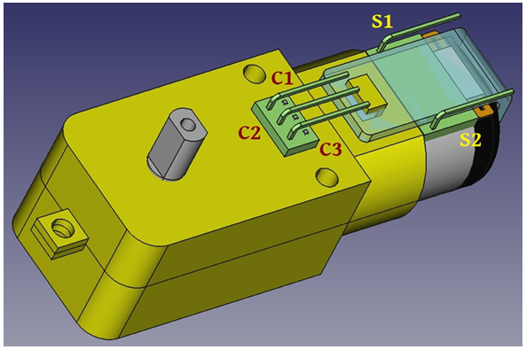

Rysunek 1: Wyglad

Wyprowadzenia C1, C2 i C3 pozwalają na podłączenie się do czujnika Halla pełniącego rolę enkodera. 
Poniższa tabela 1 przedstawia znaczenie wyprowadzeń S i C silnika:

| Wyprowadzenie | Funkcja |
| ----------- | ----------- |
| S1, S2 | Zasilanie silnika |
| C1 | Hallotron +5V |
| C2 | Hallotron GND |
| C3 | Hallotron Wyjście |

Tabela 1: Funkcje wyprowadzeń silnika.

## 1.1. Budowa silnika
Silnik stanowiący temat niniejszego ćwiczenia to silnik pradu stałego. Jest on wyposażony w przekładnię, 
która znacznie zmniejsza prędkość obrotową i zwiększa moment napędu. 
Na rysunku 2 przedstawiony został wyglad przekładni silnika.

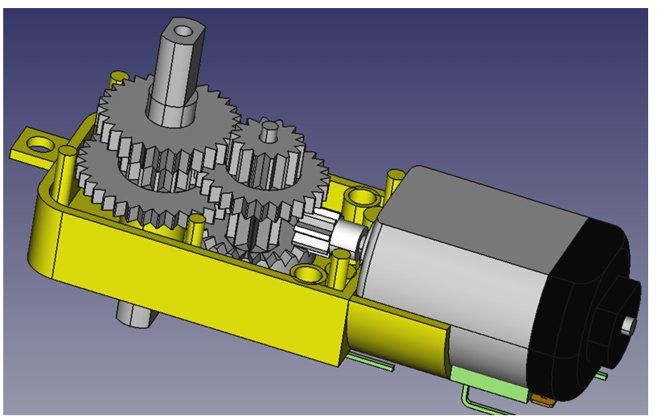

Rysunek 2: Przekładnia silnika


Składa się ona z trybu znajdującego się na wale silnika, trzech trybów pośrednich oraz trybu na wale wyjściowym. 
Tabela 2 przedstawia wykaz trybów składających się na przekładnie silnika. 
W tabeli tej są również informacje odnośnie ilości zębów poszczególnych trybów. 
Na podstawie danych trybów można obliczyć przełożenie przekładni czyli stosunek obrotów poszczególnych elementów w stosunku 
do wału wyjściowego.

| Co | Zęby 1 | Zęby 2 |
| ----------- | ----------- | ----------- |
| Tryb silnika | 8 | - |
| Tryb 1 | 9 | 24 |
| Tryb 2 | 16 | 35 |
| Tryb 3 | 14 | 28 |
| Tryb wału | 30 | - |

Tabela 2: Wykaz trybów silnika

## 1.2 Enkoder

Tryb 1 bezpośrednio podłaczony do trybu silnika został wykorzystany do budowy enkodera. 
Enkoder silnika zrealizowano wykorzystując magnesy neodymowe i przełaczalny czujnik Halla. 
Na trybie mechanizmu zostały umieszczone cztery magnesy neodymowe o naprzemiennym ułożeniu biegunów jak pokazano na rysunku 3. 
Magnesy te w momencie obracania się silnika, wytwarzają naprzemienne pole magnetyczne. 
W otoczeniu pola umieszczony jest przełączalny czujnik Halla. Prędkość i ilość zmian pola magnetycznego jest proporcjonalna do
prędkości obrotowej tego trybu, czyli również wału wyjściowego całego układu.

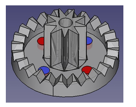

Rysunek 3: Tryb z magnesami.

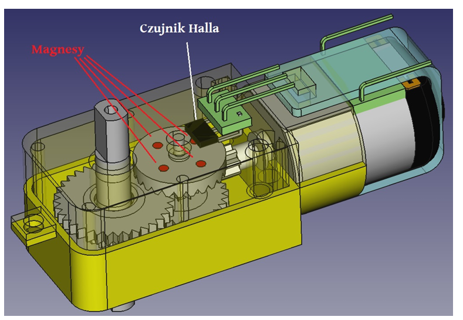

Rysunek 4: Enkoder silnika

Na rysunku 4, poprzez półprzezroczystą obudowę, przedstawiono widok budowy enkodera składajacego się z czujnika Halla oraz 
trybu z magnesami neodymowymi. Przełączalny czujnik Halla zastosowany w tym enkoderze to układ A3144. 
Jest to przełączalny czujnik pola magnetycznego o wyjściu typu otwarty kolektor (open collector OC). 
Wyjście otwarty kolektor charakteryzuje się tym, iż napięcie takiego wyprowadzenia jest równe zeru bądź nieokreślone czyli nieznane. 
W celu uzyskania wartości 0/1 czyli 0V lub 5V (w układzie TTL) stosuje się rezystor podciągający do zasilania (pullup resistor) 
natomiast rezystor podciągający do logicznego 0 to rezystor podciągający do masy (pulldown resistor). 
Na rysunku 5 przedstawiono przykład układu z zastosowanym rezystorem podciągającym do zasilania (pullup resistor).

Na rysunku 4, poprzez półprzezroczystą obudowę, przedstawiono widok budowy enkodera składającego się z czujnika Halla 
oraz trybu z magnesami neodymowymi. Przełączalny czujnik Halla zastosowany w tym enkoderze to układ A3144. 
Jest to przełączalny czujnik pola magnetycznego o wyjściu typu otwarty kolektor (open collector OC). 
Wyjście otwarty kolektor charakteryzuje się tym, iż napięcie takiego wprowadzenia jest równe zeru bądź nieokreślone czyli nieznane. 
W celu uzyskania wartości 0/1 czyli 0V lub 5V (w układzie TTL) stosuje się rezystor podciągający. 
Rezystor podciągający to element poprzez, który wyjście łączy się z napięciem zasilającym 5V lub masą 0V. 
Rezystor podciągający do napięcia zasilania czyli stanu 1 to rezystor podciągający do zasilania (pullup resistor) 
natomiast rezystor podciągający do logicznego 0 to rezystor podciągający do masy (pulldown resistor). 
Na rysunku 5 przedstawiono przykład układu z zastosowanym rezystorem podciągającym do zasilania (pullup resistor).

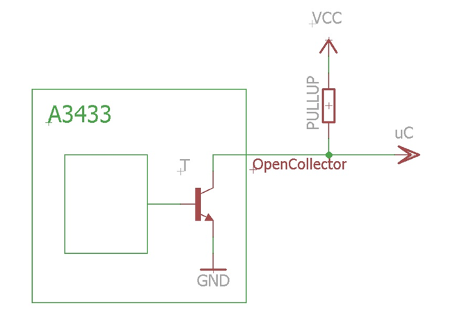

Rysunek 5: Rezystor podciągający do zasilania

Rezystor podciągający do zasilania w układzie Arduino Nano, opartym na mikrokontrolerze ATmega328P, może być również 
definiowany poprzez odpowiednią konfigurację wejścia, ze sprzętowo podłączonym rezystorem podciągającym do zasilania, 
jako INPUT_PULLUP (funkcja *pinMode*).\
W celu efektywnego zaprogramowania obsługi enkodera należy podłączyć
go do wejścia przerwań sprzętowych. Po przypisaniu odpowiedniej funkcji powiązanej 
z obsługą zmiany stanu na wejściu przerwań INT jesteśmy w stanie
obsłużyć enkoder bez straty nawet jednej zmiany stanu na wyjściu.\
Obsługa enkodera i identyfikacja prędkości wału układu może być realizowana 
na podstawie ilości impulsów występujących w określonym przedziale
czasowym lub poprzez odpowiednie przeliczenie czasu między realizacją kolejnych zmian stanu czujnika.
- Realizacja pomiaru prędkości obrotowej w oparciu o ilość impulsów generowanych
przez enkoder jest operacją stosunkowo wolną o dość długim
czasie realizacji. Jeśli chcemy by prędkość była mierzona dla użytkownika i jemu
prezentowana to możemy realizować jej pomiar w oparciu o ilość
impulsów i na podstawie ich liczby określać aktualną wartość prędkości
obrotowej wału wyjściowego układu napędowego. Dynamika człowieka
jest wystarczająco wolna.
- Innym sposobem określenia prędkości obrotowej jest jej obliczenie na
podstawie czasu między kolejnymi impulsami generowanymi przez en-
koder.

Realizacja regulatora wymaga odpowiednio małego opóźnienia pomiaru prędkości z tego też 
względu powinno się realizować pomiar prędkości na podstawie czasu między kolejnymi 
wystąpieniami impulsów enkodera. Niestety, jeśli chodzi o enkoder w opisywanym układzie napędowym to rozmieszczenie 
magnesów neodymowych a tym samym rozkład pola magnetycznego przez nie
generowanego nie jest równomiernie rozłożony. W celu uniknięcia problemu z
różnicą między wartością poszczególnych czasów między kolejnymi zmianami
stanu na wyjściu enkodera wynikającymi z jego budowy można do obliczenia
prędkości używać sumę czasów dla jednego pełnego obrotu koła zębatego z
magnesami neodymowymi.\
W tym celu dla układu napędowego użytego w ćwiczeniu należy kolejne
czasy między następującymi po sobie zmianami stanu należy zapisywać do tablicy. 
W tym przypadku będzie to tablica czteroelementowa gdyż cztery zmiany
stanu sygnału na wyjściu enkodera występują dla jednego obrotu koła zębatego enkodera.\
Na podstawie sumy czasów zapisanych w tablicy można określić czas jednego pełnego obrotu 
koła zębatego enkodera a na jego podstawie można określić prędkość obrotową wału w układzie napędowym.

## 1.3 PWM
PWM to skrót od angielskiego Pulse Width Modulation czyli modulacji szerokości impulsu. 
Modulacja szerokości impulsu może być wykorzystywana do:
- przesyłania konkretnej wartości sygnału sterującego na odległość lub po prostu do innego urządzenia
- sterowania układem analogowym z poziomu układu cyfrowego
- sterowania układem dużej mocy poprzez kluczowanie mocy dostarczanej do urządzenia
Rysunek 6 przedstawia przebieg sygnału PWM.

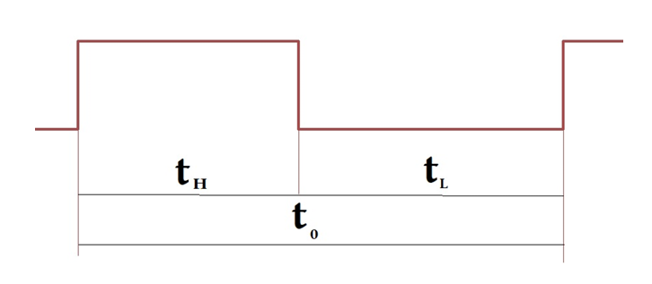

Rysunek 6: Przebieg sygnału PWM

Czas trwania impulsu w modulacji PWM to *t1* i zależy on od wartości sygnału modulującego. 
Okres *t0* i tym samym częstotliwość są często niezmienne, dlatego *t0 = tL + tH*. W przypadku, gdy PWM wykorzystujemy do sterowania
analogowym efektorem wtedy sygnał modulujący to stopień wypełnienia czyli *kW = tH / t0*.\
Do sterowania prędkością silnika w ćwiczeniu należy wkorzystać PWM.
Sterowanie silnikiem z wykorzystaniem PWM nie może odbywać się bezpośrednio z wyjścia 
mikrokontrolera (zbyt mały prąd wyjścia) i to jest powodem zastosowania tranzystora.\
Do sterowania układami dużej mocy można wykorzystywać tranzystory. Tranzystory dzielimy na bipolarne
(sterowane prądowo) i unipolarne (sterowane napięciowo).
W ćwiczeniu proponowane jest wykorzystanie tranzystora
unipolarnego typu MOSFET charakteryzującego się: niewielkimi rozmiarami, dużym prądem, niskim napięciem
bramki dla pełnego przewodzenia. Proponowany tranzystor to MTP75N03 (rysunek 7 przedstawia wygląd tranzystora).

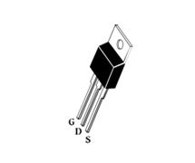

Rysunek 7: MTP75N03

Tranzystor MTP75N03 jest typu N. Rysunek 8 przedstawia symbol tego tranzystora.

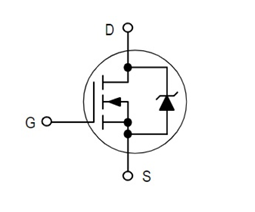

Rysunek 8: Symbol tranzystora unipolarnego MOSFET typu N

Tranzystor unipolarny podłączamy w ten sposób, że:
- bramka (Gate) to wejście, które można podłączyć bezpośrednio do układu sterującego czyli np. mikrokontrolera
- źródło (Source), jak sama nazwa mówi, podłączamy do źródła zasilania
czyli +5V lub masy 0V. Tranzystor typu N korzysta z ujemnego bieguna
źródła zasilania czyli masy.
- dren (Drain) to wyjście tranzystora, które podłączamy do urządzenia wyjściowego czyli silnika.

Przykładowy schemat ideowy układu wykorzystującego tranzystor unipolarny typu N przedstawia rysunek 9.

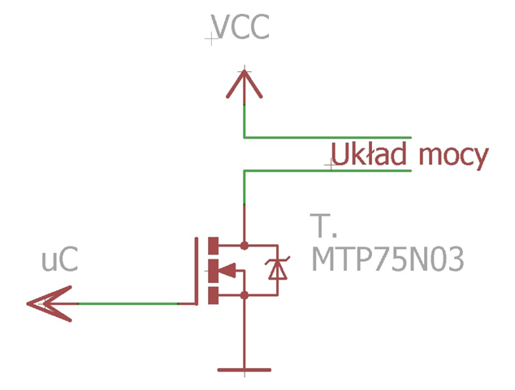

Rysunek 9: Schemat ideowy układu z tranzystorem unipolarnym typu N

Po podłączeniu tranzystora do mikrokontrolera bezpośrednio do wyjścia
PWM możemy za pomocą układu cyfrowego sterować pracą analogowego efektora.

## 2 Regulator PID
Dostarczając do wejścia układu odpowiedniego napięcia i prądu możemy sterować jego 
odpowiedzią czyli wyjściem. W przypadku silnika DC podłączając
go do odpowiedniego napięcia i dostarczając odpowiedni prąd (PWM) możemy doprowadzić 
do uzyskania określonej wartości na wyjściu silnika czyli jego
prędkości. Prędkość silnika niestety nie zależy tyko od podawanego napięcia i
prądu lecz również od innych parametrów tego efektora jak np. moment odciążenia czy aktualna 
prędkość silnika. Jest to spowodowane tym, iż w układach
dynamicznych odpowiedź nie zależy tylko i włącznie od wymuszenia ale również od stanu 
układu czyli jego parametrów wewnętrznych.
Jeśli chcemy kontrolować prędkość silnika musimy generować sygnał ste-
rujący na odpowiednim poziomie. Skuteczna realizacja procesu sterowania
prędkością sinika musi być zrealizowana z wykorzystaniem informacji o aktualnej wartości 
prędkości efektora. Do realizacji kontroli prędkości silnika można wykorzystać regulator i sprzężenie zwrotne rys. 10.

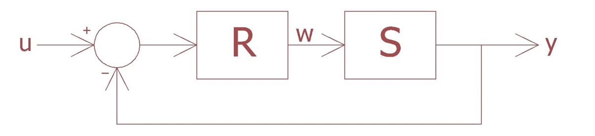

Rysunek 10: Regulator z pętlą sprzężenia zwrotnego

Wejście *u* to zadana wartość prędkości, *y* to wyjście czyli prędkość silnika oraz 
*w* to sygnał sterujący (PWM) będący wyjściem regulatora. Regulator
to ten element, który należy zrealizować w celu efektywnego sterowania prędkością silnika. 
Regulator to element realizujący odpowiednie przekształcenia
matematyczne i obliczający wartość sygnału *w = f(u - y)*. Wyróżniamy trzy bloki regulatora:
- Blok proporcjonalny *Kp * e*
- Blok całkujący *Ki * ∫e*
- Blok różniczkujący *Kd * ė*

Wyjście regulatora czyli wartość sygnału *w* dla generatora PWM będzie sumą
części proporcjonalnej, całkującej i różniczkującej (1).

*w = Kp * e + Ki * ∫e + Kd * ė* (1)

W celu zaimplementowania regulatora PID należy obliczyć błąd oraz jego całkę
i różniczkę.\
Błąd to różnica między zadana i aktualną wartością prędkości silnika. Do
wyznaczenia błędu niezbędne staje się obliczenie prędkości. Prędkość silnika mierzymy 
wykorzystując enkoder silnika. W ramach implementacji obsługi
enkodera należy zaimplementować obsługę przerwania. W pierwszej kolejności trzeba skonfigurować 
odpowiednie wejście i powiązać z nim funkcję, która będzie zawierała kod obsługujący przerwanie i enkoder.
`attachInterrupt(digitalPinToInterrupt(<inputNr>), <functionName>, <trigger>);`
- **inputNr** to numer wejścia
- **functionName** to nazwa funkcji, która zostanie uruchomiana w momencie wystąpienia przerwania
- **trigger** to sposób generowania przerwania LOW, RISING, FALLING, CHANGE

Funkcja obsługująca przerwania może być zrealizowana poprzez pomiar czasu
między kolejnymi wywołaniami funkcji i zapisanie wników w tablicy czteroelementowej typu int.

```c
void przerwanie() {
    czas = millis();
    pomiary[numer] = int(czas - pomiar);
    pomiar = czas;
    numer++;
    if (numer > 3)
        numer = 0;
}
```
W tabeli 3 znajduje się spis zmiennych globalnych użytych w funkcji przerwanie.

| Zmienna | Typ |
| ----------- | ----------- |
| czas | unsigned long |
| pomiar | unsigned long |
| numer | int |
| pomiary | int[4] |

Tabela 3: Wykaz zmiennych globalnych

Na podstawie pomiarów zrealizowanych w funkcji przerwanie i tym samym
wartości zapisanych w zmiennej *pomiary* można obliczyć wartość aktualnej
prędkości. Na podstawie ilości zębów trybów przekładni układu napędowego
oraz ilości magnesów na kole zębatym enkodera i tego, iż w zmiennej *pomiary* 
są cztery kolejne i ostatnie pomiary, można obliczyć współczynnik pozwalający
na obliczenie prędkości z sumy pomiarów zrealizowanych dla jednego pełnego
obrotu koła enkodera. Poniżej znajduje się przykładowa implementacja funkcji
realizującej obliczenie prędkości.

```c
float predkoscMierzona() {
    float suma = 0;
    for (int i = 0; i < 4; i++)
        suma += pomiary[i];

    return ((suma == 0) || (suma > 2000)) ? 0 : <współczynnik>/suma;
}
```

Element *wspołczynnik* to wartość, którą należy wznaczyć na podstawie informacji o budowie układu napędowego i enkodera.\
Należy tu również pamiętać o tym, iż w momencie, gdy silnik przestaje się
obracać przerwania nie występują. Skutecznym postępowaniem może tu być
zerowanie wartości zmiennej pomiary w momencie, gdy od ostatniego wykonania pomiaru, 
minęło więcej czasu niż maksymalna możliwa wartość pomiaru. Jeśli suma wartości zmiennej 
pomiary będzie równa zeru wtedy funkcja *predkoscMierzona* zwróci 0.\
W momencie, gdy mamy zrealizowany pomiar prędkości jesteśmy w stanie
obliczyć błąd czyli różnicę między wartością zadaną a zmierzoną. Na podstawie
błędu można zrealizować regulator proporcjonalny. Regulator proporcjonalny
charakteryzuje się wadą polegającą na tym, iż by był on w stanie generować
na wyjściu sygnał sterujący o wartości większej od zera, wejście jego musi być
różne od zera.\
Błąd możemy scałkować. Po obliczeniu całki błędu można zrealizować cześć
całkującą regulatora. By w łatwy sposób obliczyć całkę należy posłużyć się tu
pewną właściwością całki. Rysunek 11 przedstawia obliczenie całki dla krzywej *f(x)*.

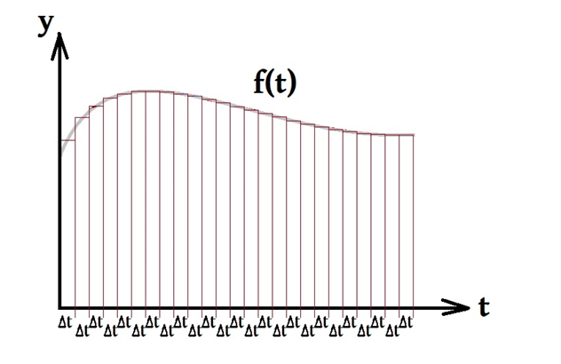

Rysunek 11: Interpretacja całki

Całka jest to pole powierzchni pod krzywą, którą całkujemy. Jak pokazano
na rysunku 11 pole powierzchni pod krzywą możemy przedstawić jako sumę
pól prostokątów odpowiadających tej krzywej. Jeśli czasy Δt są takie same dla
każdego prostokąta wtedy suma czyli całka dla danej krzywej jest proporcjo-
nalna do sumy czyli całki wartości tej krzywej. Można wtedy powiedzieć, że
całka to po prostu suma wartości.\
Realizując człon całkujący regulatora w celu wyznaczenia całki możemy
ograniczyć się do obliczenia sumy wartości zmiennej, którą chcemy całkować.
Mówiąc inaczej dla każdej iteracji funkcji *loop()* w programie do całki doda-
jemy aktualnie zmierzona wartość błędu. Na podstawie tak obliczanej całki
wyznaczamy wartość dla członu całkującego regulatora.\
Kolejnym członem jest człon różniczkujący. Przy obliczaniu pochodnej, po-
dobnie jak dla całki, możemy ograniczyć się do prostych działań matematycz-
nych. Do obliczenia pochodnej można wykorzystać po prostu różnicę wartości
funkcji dla kolejnych iteracji funkcji *loop()*.\
Odpowiedni dobór wartości współczynników *Kp*, *Ki* oraz *Kd* pozwala na zrealizowanie regulatora, 
który wysteruje nasz efektor w sposób o jaki nam chodzi.

## 3 Komunikacja

By efektywnie zarządzać pracą silnika należy zrealizować w odpowiedni sposób wymianę informacji 
między sterownikiem silnika a urządzeniem stanowiącym interfejs użytkownika np. komputerem.

Do realizacji komunikacji wykorzystane zostanie łącze szeregowe miedzy komputerem a sterownikiem silnika. 
Podstawą realizacji procesu wymiany informacji między urządzeniami jest zdefiniowanie protokołu. Komunikacja 
ma służyć do zadania parametrów pracy urządzenia, odczytu aktualnych wartości parametrów oraz odczytu aktualnej 
wartości prędkości zadanej i mierzonej czyli:
- zadawanie prędkości silnika
- definiowanie ustawień regulatora *Kp*, *Ki* oraz *Kd*
- pytanie o wartość ustawień regulatora
- cykliczne przesyłanie wartości prędkości aktualnej i zadanej

Wiadomość przekazywana z komputera do sterownika arduino proponowana jest w następującym formacie:

`cX`

gdzie *c* to znak identyfikujący komendę a *X* to nowa, zadana wartość dla tej komendy, przy czym jedna komenda to jedna linia tekstu.\
Z arduino do komputera proponuje się przekazywanie wiadomości zgodnie z następującym schematem:

`c = X`

gdzie *c* to identyfikator wartości a *X* to wartość. W tabeli 4 znajduje się definicja identyfikatorów dla komend 
przekazywanych między urządzeniami.

| znak | znaczenie                            |
| ---- | ------------------------------------ |
| s    | prędkość                             |
| p    | współczynnik *Kp* regulatora         |
| i    | współczynnik *Ki* regulatora         |
| d    | współczynnik *Kd* regulatora         |
| ?    | pytanie o aktualne wartości param.   |

Tabela 4: Identyfikatory komend

Poniżej przedstawiono przykładowy fragment kodu pozwalający na realizację odbioru informacji ze strony sterownika silnika w arduino:

```c
if (Serial.available()) {
    char cCo = Serial.read();
    switch (cCo) {
        case 'S':
        case 's':
            iPredkoscZadana = Serial.parseInt();
            break;
    }
}
```

## 4 Zadania do zrealizowania

Zadania do wykonania to:
- Zbudowanie układu na bazie Arduino Nano, który będzie mógł kontrolować prędkość silnika
obracającego się w jedną stronę. W celu realizacji tego zadania należy podłączyć do wyjścia PWM modułu
Arduino przez tranzystor unipolarny MTP75N03 oraz podłączyć wyprowadzenia enkodera tak by możliwe było
realizowanie zliczania impulsów poprzez wykorzystanie przerwań.

- Zaimplementowanie programu sterującego prędkością silnika. W ramach realizacji tego zadania należy
  – zaimplementować realizację pomiaru prędkości silnika.  
  – zaimplementować możliwość wymiany informacji między Arduino a urządzeniem sterującym.  
  – zaimplementować regulator PID  
  – zaimplementować na Raspberry program pozwalający na realizację obsługi silnika. Program powinien:
      * wyświetlać aktualną prędkość silnika
      * umożliwiać zadawanie prędkości silnika
      * umożliwiać definiowanie nastaw regulatora
      * wyświetlać aktualne nastawy regulatora

- dobrać nastawy regulatora PID tak aby sterowanie prędkością silnika było efektywne

## 5 Pytania kontrolne

Poniżej przedstawiono pytania kontrolne pozwalające na zrozumienie zagadnienia i elementów wykorzystywanych w 
danym ćwiczeniu. Proszę mieć na uwadze to, iż w powyższym opisie ćwiczenia nie ma odpowiedzi na wszystkie 
pytania a jedynie wskazówki pozwalające na ich zrealizowanie.

**Pytania kontrolne:**
- Jak obliczamy stosunek obrotu połączonych ze sobą kół zębatych o różnej liczbie zębów?
- Co to jest i do czego służy enkoder?
- W jaki sposób można mierzyć prędkość obrotową?
- Czym charakteryzuje się wyjście otwarty kolektor?
- Co to jest rezystor podciągający?
- Gdzie, dlaczego i po co stosuje się rezystor podciągający?
- Co można mierzyć za pomocą czujnika Halla?
- Ile razy obróci się tryb z magnesami enkodera przy jednym obrocie walu wyjściowego układu napędowego w ćwiczeniu?
- Ile razy wystąpi zmiana stanu na wyjściu enkodera dla jednego obrotu wału wyjściowego układu napędowego w ćwiczeniu?
- Co to jest przerwanie i do czego służą przerwania?
- Co można wyznaczyć zliczając impulsy enkodera?
- Co to jest PWM?
- Do czego wykorzystujemy PWM?
- Co to jest i do czego służy tranzystor?
- Jakie są rodzaje tranzystorów?
- Jak sterujemy prądem wyjściowym tranzystora unipolarnego?
- Co to jest regulator PID?
- Gdzie i do czego wykorzystujemy regulator?
- Jak obliczyć całkę sygnału?
- Jak obliczyć różniczkę sygnału?
- Co musi mieć zdefiniowane każda komunikacja?
